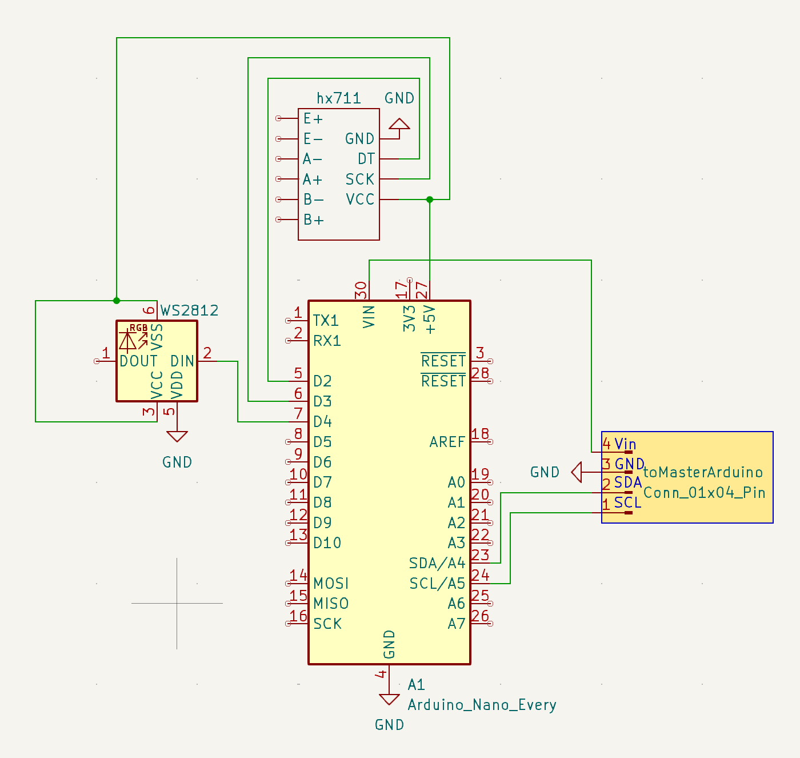

# Wave 🎛️  
*A Modular Interactive Sequencer for kids*

## Overview

**Wave** is a modular, interactive sequencer designed for physical engagement and flexible arrangement. Using hexagonal modules connected via joints, users can build and reshape the instrument in a variety of layouts.

Each module responds to weight through a **load cell**, allowing the **pitch** to change based on the object placed on it. This tactile interface enables intuitive sound control, offering a unique experience compared to traditional sequencers.

## How It Works

- **Modular Design**  
  Hexagonal modules connect via joints, forming custom configurations.

- **Weight-Based Pitch Control**  
  Each module uses a load cell to detect weight, which determines the pitch of the step.

- **I2C Communication**  
  Each module contains a **Slave Arduino** that sends data to the **Master Arduino** over I2C.

- **Signal Output**  
  The master processes the input and generates **Gate** and **CV Out** signals to control external analog or modular synths.

- **Planned Features**  
  - Tempo control  
  - Expanded CV/Gate behavior  
  - Custom sequencing logic  

## 3D Model

You can download the 3D model of Wave and use it for printing or modification. Below is a preview of the model:

## Circuit Design

The circuit for Wave was designed using **KiCad**. Below are previews of the schematic symbol and PCB layout:

**Schematic Symbol**  

**PCB Layout**  

## Applications

Wave is ideal for experimental music setups, sound installations, or educational environments where interaction, modularity, and sound design meet.

## Status

🚧 *Wave is currently under development. More updates and documentation will be available soon.*

